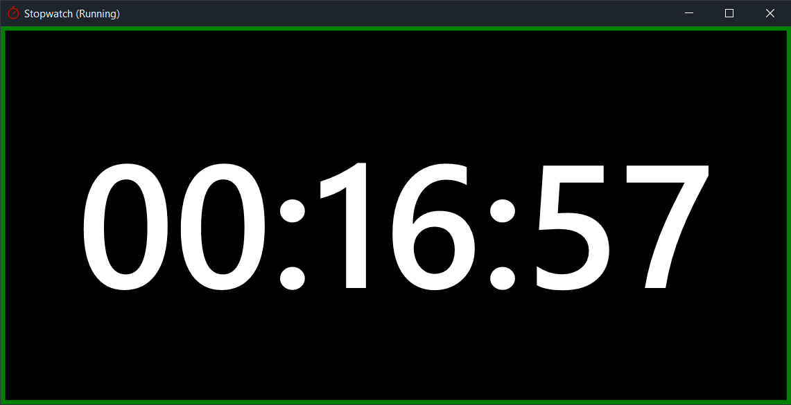

# Stopwatch



This is a very simple stopwatch app for Windows 10. If this works in any other 
version of Windows it is entirely by chance, and it's the only Windows 
Presentation Framework app I've ever written so don't expect too much.

## Building

Click build. I honestly don't know what else is required here.

## Usage

There is no mouse UI for controlling this stopwatch, because visual controls 
are ugly and mice are the worst. Press **spacebar** to start and stop the 
timer, and press **escape** to reset (there is a prompt in case you press it 
by mistake).

This app **automatically binds a global hotkey**, which is `Ctrl-Shift-Q`. 
There is no UI for changing this, so edit the code if you want a different 
one. I use this app to keep track of how long I stand at my standing desk and 
I created a giant arcade button that sends that key sequence so I can start 
and stop it. Yeah I have too much time on my hands I get it.

## License

```
           DO WHAT THE FUCK YOU WANT TO PUBLIC LICENSE
                   Version 2, December 2004
 
Copyright (C) 2004 Sam Hocevar <sam@hocevar.net>

Everyone is permitted to copy and distribute verbatim or modified
copies of this license document, and changing it is allowed as long
as the name is changed.
 
           DO WHAT THE FUCK YOU WANT TO PUBLIC LICENSE
  TERMS AND CONDITIONS FOR COPYING, DISTRIBUTION AND MODIFICATION

 0. You just DO WHAT THE FUCK YOU WANT TO.
```
